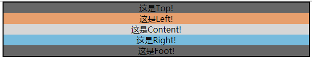
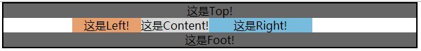
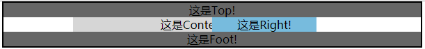
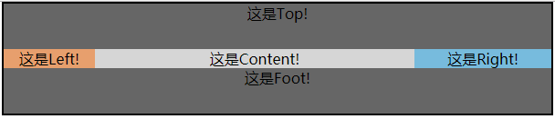
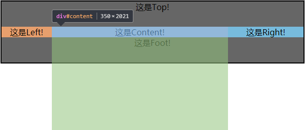
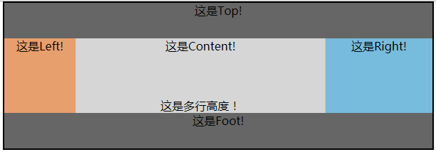

## 圣杯布局（双飞翼布局）

> 参考原文
[【CSS】 布局之圣杯布局](http://www.cnblogs.com/linxiong945/p/4041841.html)

#### 一、三种css技术

- 浮动 float

1.由于浮动框不在文档的普通流中，所以文档的普通流中的块框表现得就像浮动框不存在一样。（w3c）

2.当一个元素块被浮动后，其在原文档流中的空间被关闭，后面的内容会向前补充，这样很容易造成后面的元素包围了浮动的元素块。
(chrome的审查元素会看到被float的元素display属性变成block)

3.为了解决这个问题，我们可以用clear方法来阻止行框包围元素块。


- 绝对定位和相对定位 absolute,relative

1.我们通过position属性来声明这个元素块进行绝对定位或者相对定位。如果要进行定位的是行内元素，首先需要用display:block来将其声明为一个块级元素。

2.两者的区别为：
  
  相对定位是相对于自身在文档流中的原有位置的起点为基准进行位移定位。其在文档流中的位置不会被关闭。
  
  绝对定位是相对于最接近的已定位父元素的起点为基准，如果没有已定位的父元素，则为其最初的包含块，也就是body。绝对定位相对于相对定位的不同，是其在文档流中的元素框被关闭，该位置被后面的元素填充。
  
- 负边距 negative margin

1.内边距padding是元素内容与边框之间的距离，外边距margin为元素边框到父元素框外边距之间的距离。

2.内边距padding只能设置为正值，而外边距margin可以设置为正值也可以设置为负值。

3.我们还需要了解一点，元素的背景是可以占用内边距padding距离的。


#### 二、基本布局

见2.basicLayout.html

> 初始布局

```css
/** 
 * styles/2.basicLayout.css 
 */

* {
    margin: 0;
    padding: 0;
    text-align: center;
}

#parent {
    width: 600px;
    border: 2px solid;
    margin: 0 auto;
}

#top {
    background-color: #666;
}

#left {
    background-color: #e79f6d;
}

#content {
    background-color: #d6d6d6;
}

#right {
    background-color: #77bbdd;
}

#foot {
    background-color: #666;
}
```

```html
<div id="parent">
    <div id="top">这是Top!</div>
    <div id="main">
        <div id="left">这是Left!</div>
        <div id="content">这是Content!</div>
        <div id="right">这是Right!</div>
    </div>
    <div id="foot">这是Foot!</div>
</div>
```



> 加工

1.将中间left、content和right向左浮动，并设置left和right的宽度分别设置为100px和150px，将三者的父元素（main）的左右内边距设置为100px和150px，与left和right的宽度相同。
然后我们将foot清除浮动。


2.content宽度设置了100%，故而其宽度不够，所以content和right就掉下来了，对于这个我们可以为content和right设置一个margin-left属性来解决这个问题。
```css
#content {
    margin-left: -100px;
    width: 100%;
    background-color: #d6d6d6;
}

#right {
    margin-left: -150px;
    width: 150px;
    background-color: #77bbdd;
}
```
但是left被content挡住了。


3.我们用相对定位把left向左移，right向右移。并把top和foot设置高度为50px;
```css
#left {
    position: relative;
    left: -100px;
    width: 100px;
    background-color: #e79f6d;
}

#right {
    position: relative;
    left: 150px;
    margin-left: -150px;
    width: 150px;
    background-color: #77bbdd;
}
```


4.看起来差不多了，不过我们还需要处理一个问题，就是中间三列的等高问题

```css
#main {
    padding-left: 100px;
    padding-right: 150px;
    overflow: hidden;
}

#left, #content, #right {
    padding-bottom: 2000px;
    margin-bottom: -2000px;
}
```


5.完成

当我们给三者无论哪个添加内容时，三列的高度总会以最高的那列为准维持等高。

在这个布局中，主要内容content的宽度是自适应的，而left和right的宽度是固定的，当我们增加parents的宽度时，content的宽度随之增加，left和right保持不变。

这就是圣杯布局，也有叫做双飞翼布局的。


而且我们通过相对定位，可以通过计算，随意定制left、content和right三者的前后顺序。

#### 三、总结

> 优点

- 实现了内容与布局的分离，即Eric提到的Any-Order Columns.
- content部分是自适应宽度的，很容易在定宽布局和流体布局中切换。
- 任何一栏都可以是最高栏，不会出问题。
- 需要的hack非常少（就一个针对ie6的清除浮动hack:_zoom: 1;）
- 在浏览器上的兼容性非常好，IE5.5以上都支持。

> 不足

- content需要添加一个额外的包裹层。
- 等待你的发现与反馈。
