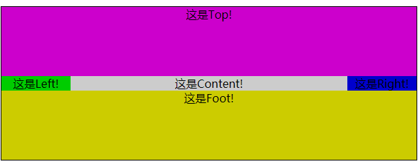

## 多列等高布局

#### 第一步：写一个坯子
```html
<div id="parent">
    <div id="top">这是Top!</div>
    <div id="main">
        <div id="left">这是Left!</div>
        <div id="content">这是Content!</div>
        <div id="right">这是Right!</div>
    </div>
    <div id="foot">这是Foot!</div>
</div>
```


#### 第二步: 给这些加上背景色，并将整个parent居中
```css
* {
    margin: 0;
    padding: 0;
    text-align: center;
}

#parent {
    width: 600px;
    margin: 100px auto 0;
    border: 1px solid;
}

#top {
    background-color: #c0c;
}

#left {
    background-color: #0c0;
}

#content {
    background-color: #ccc;
}

#right {
    background-color: #00c;
}

#foot {
    background-color: #cc0;
}
```


#### 第三步：我们给top和foot设置100的高度，并将left和content向左浮动，right向右浮动。


把foot给clear一下


#### 第四步：我们给left、content、right分别设置宽度100px、400px、100px。


#### 5.不过这里的设置还有一个大问题，在网页布局中，中间的left、content、right是根据实际需要添删内容的，而各列高度很多时候都不一样。比如我们设置left的高度为100px。


### ⭐一个负边距的使用技巧

> padding补偿法

首先把列的padding-bottom设为一个足够大的值，

再把列的margin-bottom设一个与前面的padding-bottom的正值相抵消的负值，

父容器设置超出隐藏，

这样子父容器的高度就还是它里面的列没有设定padding-bottom时的高度，

当它里面的任一列高度增加了，则父容器的高度被撑到它里面最高那列的高度，其他比这列矮的列则会用它们的padding-bottom来补偿这部分高度差。

因为背景是可以用在padding占用的空间里的，而且边框也是跟随padding变化的，这样就成功的使得三者列高最起码看起来是等高的。这样也就满足了我们的需求。

现在产生了一个问题，高度溢出了。

我们可以对其父元素配置一个overflow: hidden来对溢出部分进行修剪。
